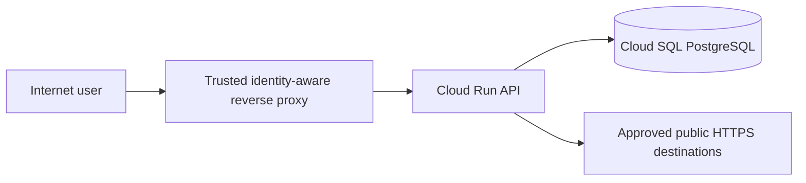

# Intended architecture

The diagram below describes the intended production request path for the training system.

## Trust assumptions

- The reverse proxy authenticates users before requests reach the application.
- The reverse proxy removes any client-supplied `x-user-id` header and injects a verified user ID.
- The Cloud Run API is not intended to be directly reachable by Internet users.
- `/api/admin/*` must additionally enforce application-level authorization based on the user's role.
- The preview feature needs outbound access only to approved public HTTPS destinations.
- The database is an internal application resource and is not intended to accept direct public Internet connections.
- The application runtime identity should use least privilege.

The Terraform in `infra/` represents a production-like deployment fixture. Review whether the implementation actually preserves these assumptions.
